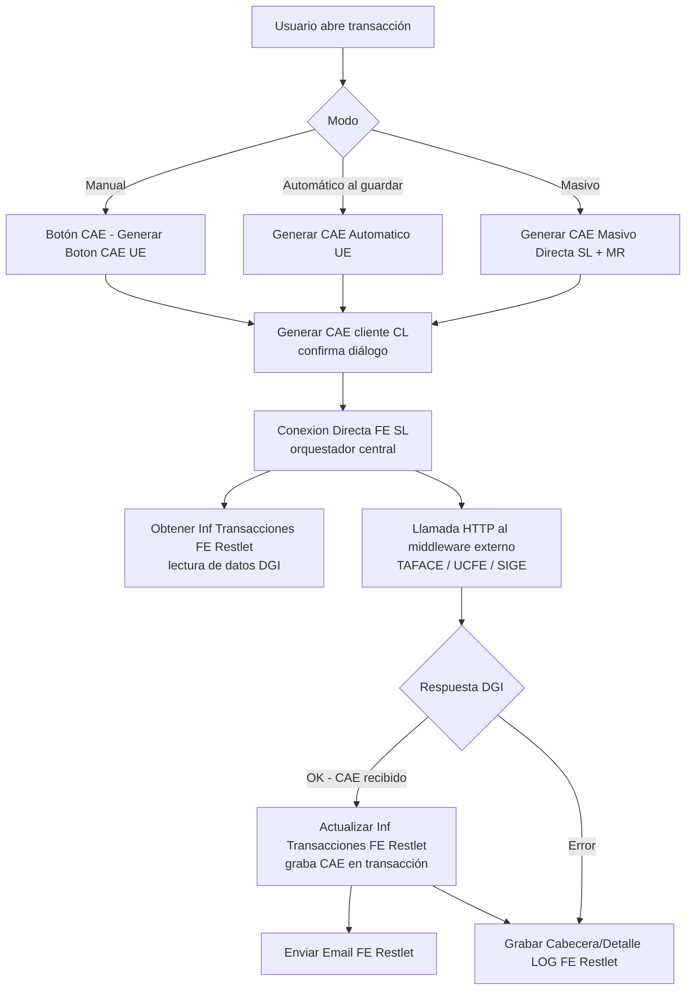
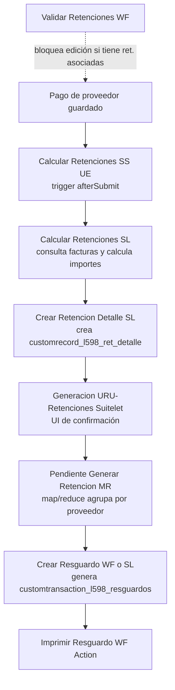
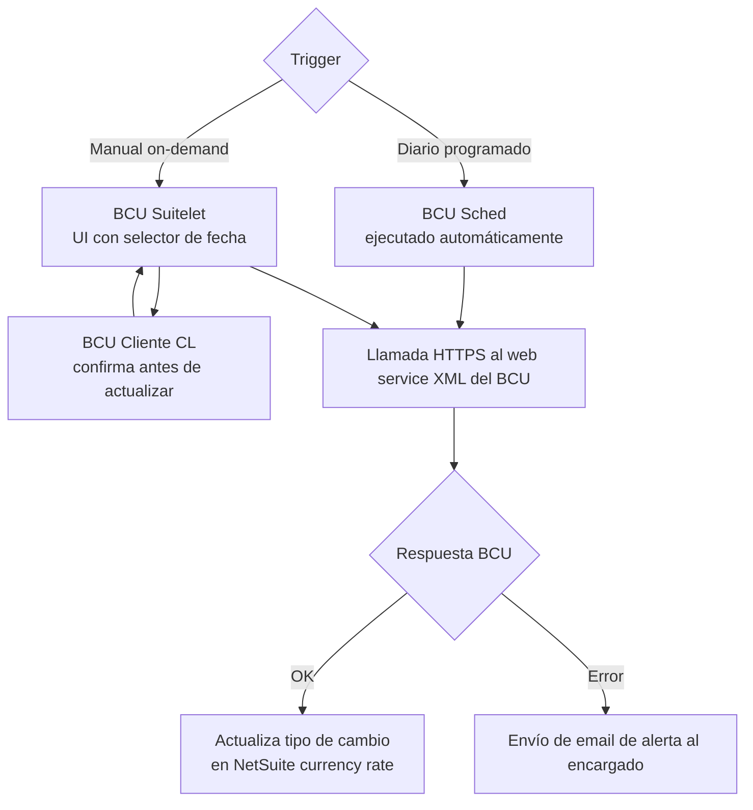
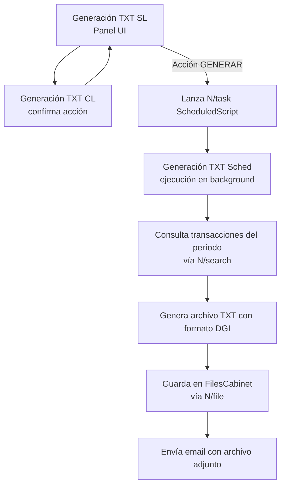
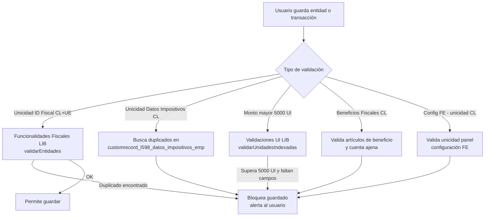
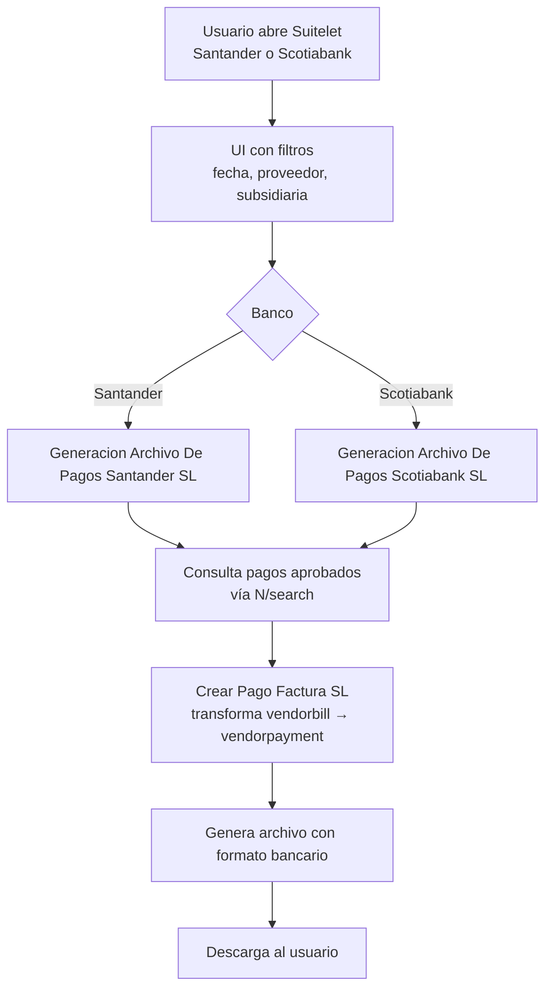

# LOC-UY-Suitetax — Project Overview

> Localización fiscal Uruguay para NetSuite (SuiteTax). Conjunto de SuiteScripts 2.0/2.1 que automatizan facturación electrónica DGI (CAE), retenciones de impuestos, generación de resguardos, integración con tipo de cambio BCU, validaciones fiscales, reportería tributaria (TXT DGI) y archivos de pago bancarios.

---

## Stack

- **Plataforma**: Oracle NetSuite — SuiteScript 2.0/2.1 (AMD `define()`), SuiteTax Engine.
- **Patrón de módulos**: AMD puro — `define([deps], function(deps){ ... })`. Sin `import`/`export` ni CommonJS.
- **Dependencias nativas**: `N/record`, `N/search`, `N/format`, `N/runtime`, `N/file`, `N/https`, `N/email`, `N/task`, `N/url`, `N/currency`, `N/render`, `N/redirect`, `N/query`, `N/xml`, `N/ui/serverWidget`, `N/ui/dialog`.
- **Aliases del proyecto**: definidos en `configuration.json` (raíz) y `configuration_l598.json` (sub-carpeta), mapeados a rutas absolutas del FileCabinet de NetSuite.
- **Sin test runner**: no hay archivos `*.test.js` ni framework de tests.
- **Versiones coexistentes**: varios scripts con sufijo `V2` conviven con sus predecesores en producción.

---

## Estructura de carpetas

```
workspace-loc-uru-suitetax/
└── LOC-UY-Suitetax/
    ├── configuration.json          ← aliases AMD globales (3K, L598, L54, L56, L593, EC)
    ├── README.md                   ← trivial, sin contenido relevante
    └── LOC UY/
        ├── configuration_l598.json ← aliases AMD locales (L598/utilities, L598/funcionalidadesFiscales, URU/Validaciones...)
        ├── *.js                    ← 73 módulos SuiteScript (UE, CL, SL, MR, SS, WF, Restlet, LIB)
        └── *.html                  ← 11 plantillas TAFACE para impresión de comprobantes DGI
```

**Nota**: `3K - Utilities.js` y `L595/utilidades` son referenciados por alias desde `configuration.json` pero sus fuentes no están presentes en este repositorio (probablemente residen en otro proyecto/bundle de NetSuite FileCabinet).

---

## Módulos funcionales

### 1. Facturación Electrónica (FE) / CAE

Automatiza la obtención del Código de Autorización Electrónica (CAE) ante la DGI para facturas, tickets y notas de crédito/débito. Soporta tres modalidades: manual (botón en transacción), automático (UE al guardar) y masivo (MR sobre lotes). La integración con DGI se realiza vía un middleware externo (URL configurable por subsidiaria); los proveedores soportados incluyen TAFACE, UCFE y SIGE. Registra cada operación en un log custom (`customrecord_l598_fact_elec_log`).

**Scripts:**
- `L598 - Generar Boton CAE` (UE)
- `L598 - Generar CAE (cliente)` (CL)
- `L598 - Generar CAE Automatico` (UE)
- `L598 - Generación de CAE Automatico (MR)` (MR)
- `L598 - Generar CAE Masivo Directa (SL)` (SL)
- `L598 - Generar CAE Masivo Directa (Cliente)` (CL)
- `L598 - Generar CAE Lotes` (SS/Sched)
- `L598 - Conexion Directa FE (SL)` (SL) ← orquestador central de la llamada a DGI
- `L598 - Conexion Directa FE (CL)` (CL)
- `L598 - Conexion Directa FE (SS)` (UE) ← el nombre dice SS pero el NScriptType es UserEventScript
- `L598 - Obtener Inf Transacciones FE` (Restlet)
- `L598 - Actualizar Inf Transacciones FE` (Restlet)
- `L598 - Enviar Email FE` (Restlet)
- `L598 - Grabar Cabecera LOG Proceso FE` (Restlet)
- `L598 - Grabar Detalle LOG Proceso FE` (Restlet)
- `L598 - Validar Unicidad Conf FE` (CL)
- `L598 - Procesar Transacciones (Cliente)` (CL)
- `L598 - Procesar TransaccionesV2` (SL)

**Integración externa**: Middleware FE (URL configurable) → DGI Uruguay (TAFACE / UCFE / SIGE).

---

### 2. Retenciones

Calcula y genera retenciones de impuestos (IRPF, IRNR, IRAE, IVA) sobre facturas de proveedor y notas de crédito. El ciclo es: búsqueda de transacciones pendientes → cálculo de importes → creación de registros `customrecord_l598_ret_detalle` → generación de la transacción URU-Retención. Un WF Action bloquea la edición de facturas ya incluidas en una retención.

**Scripts:**
- `L598 - Calcular Retenciones (SL)V2` (SL)
- `L598 - Calcular Retenciones (SS)V2` (UE) ← el nombre dice SS pero NScriptType es UserEventScript
- `L598 - Crear Retencion Detalle (SL)V2` (SL)
- `L598 - Pendiente Generar Retencion (MR)V2` (MR)
- `L598 - Generacion URU-Retenciones (Suitelet)` (SL) ← panel UI + lanzador de MR
- `L598 - Validar Retenciones` (WF)

---

### 3. Resguardos

Genera, anula e imprime la transacción custom `customtransaction_l598_resguardos` (tipo de comprobante DGI 182). Existe una variante para compras (proveedores) y otra para ventas. La creación puede dispararse desde un Workflow Action o desde un Suitelet con interfaz de usuario. El módulo depende de un alias `L598/crear_resguardo` que **no está presente en este repositorio** (dependencia externa).

**Scripts:**
- `L598 - Crear Resguardo (SL)V2` (SL)
- `L598 - Crear Resguardo (WF)` (WF)
- `L598 - Generacion URU-Resguardo (SL)` (SL) ← UI compras
- `L598 - Generacion URU-Resguardo (MR)` (MR)
- `L598 - Generacion URU-Resguardo (Cliente)` (CL)
- `L598 - Generacion URU-Resguardo-Ventas (SL)` (SL) ← UI ventas
- `L598 - Generacion URU-Resguardo-Ventas (MR)` (MR)
- `L598 - Generacion URU-Resguardo-Ventas (Cliente)` (CL)
- `L598 - Anulacion URU-Resguardo-Ventas (UE)` (UE)
- `L598-Imprimir ResguardoV2` (WF) ← WF Action que redirige a impresión

---

### 4. Integración Tipo de Cambio BCU

Consume el web service del Banco Central del Uruguay (BCU) para obtener y actualizar el tipo de cambio de monedas configuradas. Puede ejecutarse en forma programada (diaria) o manualmente desde un Suitelet con selector de fecha. Un CL confirma la acción antes de persistir.

**Scripts:**
- `L598 - Integracion Tipo de Cambio BCU (Sched)` (Sched)
- `L598 - Integracion Tipo de Cambio BCU (Suitlet)` (SL) ← typo en el nombre de archivo
- `L598 - Integracion Tipo de Cambio BCU (Cliente)` (CL)

**Integración externa**: Web service XML del BCU (Banco Central del Uruguay).

---

### 5. Balance / Reportería Tributaria

Genera archivos TXT para presentación ante la DGI (declaraciones periódicas) y un panel de balance tributario local. El Scheduled Script ejecuta la generación en background; el Suitelet expone la UI y el Client Script maneja la confirmación del usuario.

**Scripts:**
- `L598 - Balance Tributario Loca` (SL) ← panel de balance tributario (typo en nombre)
- `L598 - Generación TXT Localizaciones (Sched)` (Sched)
- `L598 - Generación TXT Localizaciones (SL)` (SL)
- `L598 - Generación TXT Localizaciones (CL)` (CL)

---

### 6. Pagos

Genera archivos de pago en formato bancario (Santander y Scotiabank Uruguay) desde un Suitelet. Crea registros `vendorpayment` asociando la factura de proveedor con su retención correspondiente. Incluye un Workflow Action para imprimir pagos múltiples (prefijo PRY, probablemente compartido con localización Paraguay).

**Scripts:**
- `L598 - Generacion Archivo De Pagos Santander (Suitelet)` (SL)
- `L598 - Generacion Archivo De Pagos Scotiabank (Suitelet)` (SL)
- `L598 - Crear Pago Factura (SL)V2` (SL)
- `PRY - Imprimir Pago Múltiple (Wf Action)` (WF) ← prefijo PRY, depende de `L595/utilidades`

**Integraciones externas**: Banco Santander Uruguay (formato de archivo), Scotiabank Uruguay (formato de archivo).

---

### 7. Validaciones / Configuración

Scripts que validan unicidad y consistencia de datos fiscales en el momento de guardar registros. Cubren: unicidad de identificación fiscal de entidades (clientes, proveedores, empleados), unicidad de configuración de datos impositivos de empresa, validación de cajas/sucursales, y unicidad de configuraciones de beneficios y cuenta ajena.

**Scripts:**
- `L598 - Validacion Unicidad Identificacion Fiscal (CL)` (CL)
- `L598 - Validacion Unicidad Identificacion Fiscal (UE)` (UE)
- `L598 - Unicidad Datos Impositivos` (CL)
- `L598 - Validar Cajas Sucursales` (CL)
- `l598 - Unicidad Beneficios Fiscales Config` (CL)
- `l598 - Unicidad Configuracion de Datos Cuenta Ajena` (CL)

---

### 8. Manejo de Transacciones

Scripts que se ejecutan en eventos de transacción (antes/después de cargar, antes/después de guardar). Gestionan seteo de campos fiscales, herencia de datos de proveedor, manejo de NC/ND con y sin referencia, anulación de cobranza y seteo de tax codes del engine SuiteTax.

**Scripts:**
- `L598 -Transacción (Cliente)` (CL) ← manejador de eventos cliente para transacciones
- `L598 -Transacción (Servidor)` (UE) ← manejador de eventos servidor para transacciones
- `L598 - Manejo NC y ND Con y Sin Referencia (CL)` (CL)
- `URU - Heredar Campos` (UE) ← copia campos fiscales del proveedor a la OC
- `L598 - Setear Fecha Vencimiento` (UE)
- `L598 - Setear Unidad Indexada` (UE) ← actualiza UI (Unidad Indexada) en transacción según config FE
- `L598 - Setear Valores Anulacion Cobranza` (UE)
- `L598 - Seteo Campos Gastos Refacturables` (UE)
- `L598 - Seteo de Tax Codes` (UE) ← asigna tax codes SuiteTax basados en taxdetails
- `3K - Seteo Tax Code Equivalente Ventas` (UE) ← setea tax code equivalente en ventas
- `3K-Verificar Tax Codes Group Items` (UE) ← valida tax codes en ítems de grupo

---

### 9. Datos Maestros / Entidades

Scripts sobre registros de entidades (Customer, Vendor, Employee). Completan el número de identificación fiscal, asignan el rubro IVA a líneas de transacciones.

**Scripts:**
- `L598 - Customer (Cliente)` (CL) ← eventos cliente en ficha de cliente
- `L598 - Completar Numero de Identificacion Fiscal (CL)` (CL)
- `L598 - Completar Numero de Identificacion Fiscal (UE)` (UE)
- `L598 - Asignar Rubro IVA` (UE) ← asigna rubro IVA a ítems/gastos de transacciones

---

### 10. Descuentos / Beneficios Fiscales

Scripts que calculan y validan descuentos por beneficios fiscales (Ley de Promoción de Inversiones u otros) y por cuenta ajena, generando asientos contables auxiliares (Journal Entry) y actualizando la adenda de la transacción.

**Scripts:**
- `L598 - Descuento por Beneficio Cliente` (UE)
- `L598 - Descuento por Cuenta Ajena` (UE)
- `l598 - Cuenta Ajena` (CL) ← validación cliente sobre artículos de cuenta ajena
- `l598 - Validacion Beneficios Fiscales Transaccion` (CL)

---

### 11. Validaciones Montos > 5000 UI

Trío de scripts que obligan a completar campos fiscales (tipo y número de documento, país de origen) cuando el importe de una transacción supera las 5000 Unidades Indexadas. La librería centraliza la lógica; el CL valida en cliente y el UE (nombrado SS) valida en servidor.

**Scripts:**
- `URU - Validaciones por transaccion mayor a 5000 ui (LIB)` (LIB)
- `URU - Validaciones por transacciones mayor a 5000 ui (CL)` (CL)
- `URU - Validaciones por transacción mayor a 5000 ui (SS)` (UE) ← nombre dice SS, NScriptType es UserEventScript

---

### 12. Utilities

Bibliotecas de funciones compartidas. `L598 - Utilities` provee helpers genéricos (`isEmpty`, `padding_left/right`, `l598esOneworld`, etc.). `L598 - Funcionalidades Fiscales` concentra la lógica fiscal reutilizable (`validarEntidades`, `consultarNumeroFiscal`). Ambas se consumen vía alias AMD `L598/utilities` y `L598/funcionalidadesFiscales`.

**Scripts:**
- `L598 - Utilities` (LIB)
- `L598 - Funcionalidades Fiscales` (LIB)

---

## Flujos clave (mermaid)

### 1. Generación de CAE (Facturación Electrónica)



> Simplificación: el diagrama omite el Scheduled de lotes (`L598 - Generar CAE Lotes`) y las variantes de parámetros por proveedor FE. El orquestador real es `Conexion Directa FE (SL)`.

---

### 2. Cálculo y Generación de Retenciones



---

### 3. Integración BCU (Tipo de Cambio)



---

### 4. Generación TXT Localizaciones (Reporte DGI)



---

### 5. Validaciones Fiscales Pre-guardado



---

### 6. Generación Archivo de Pagos Bancarios



---

## Templates TAFACE (Plantillas DGI)

| Código DGI | Nombre | Archivo HTML | Tipo de comprobante |
|-----------|--------|-------------|-------------------|
| 101 | Ticket | `101 - Ticket (TAFACE).html` | e-Ticket (consumidor final) |
| 102 | Nota de Crédito de Ticket | `102 - Nota de Crédito de Ticket (TAFACE).html` | NC sobre e-Ticket |
| 103 | Nota de Débito de Ticket | `103 - Nota de Dédito de Ticket (TAFACE).html` | ND sobre e-Ticket (typo en nombre) |
| 111 | Factura | `111 - Factura (TAFACE).html` | e-Factura local |
| 112 | Nota de Crédito de Factura Local | `112 - Nota de Crédito de Factura Local (TAFACE).html` | NC sobre e-Factura |
| 113 | Nota de Débito de Factura Local | `113 - Nota de Dédito de Factura Local (TAFACE).html` | ND sobre e-Factura (typo en nombre) |
| 121 | Factura Exportación | `121 - Factura Exportación (TAFACE).html` | e-Factura exportación |
| 122 | Nota de Crédito de Factura Exportación | `122 - Nota de Crédito de Factura Exportación (TAFACE).html` | NC sobre exportación |
| 123 | Nota de Débito de Factura Exportación | `123 - Nota de Debito de Factura Exportación (TAFACE).html` | ND sobre exportación |
| 181 | Remito | `181 - Remito (TAFACE).html` | e-Remito |
| 182 | Resguardos | `182 - Resguardos (TAFACE).html` | Resguardo de retenciones |

---

## Tabla maestra de scripts

| Archivo | Prefijo | Tipo | Módulo | Propósito |
|---------|---------|------|--------|-----------|
| L598 - Utilities | L598 | LIB | Utilities | Funciones helper compartidas: isEmpty, padding, l598esOneworld, etc. |
| L598 - Funcionalidades Fiscales | L598 | LIB | Utilities | Lógica fiscal reutilizable: validarEntidades, consultarNumeroFiscal |
| URU - Validaciones por transaccion mayor a 5000 ui (LIB) | URU | LIB | Validaciones 5000 UI | Librería: calcula si transacción supera 5000 UI y qué campos faltan |
| L598 - Generar Boton CAE | L598 | UE | FE / CAE | Agrega botón CAE a la transacción y dispara la generación manual |
| L598 - Generar CAE Automatico | L598 | UE | FE / CAE | Genera CAE automáticamente al guardar la transacción |
| L598 - Generación de CAE Automatico (MR) | L598 | MR | FE / CAE | Procesa en map/reduce la generación masiva de CAE para un lote de transacciones |
| L598 - Generar CAE (cliente) | L598 | CL | FE / CAE | Cliente script auxiliar: envía acción GENERAR_CAE al formulario |
| L598 - Generar CAE Masivo Directa (SL) | L598 | SL | FE / CAE | Suitelet UI para selección y disparo de generación masiva de CAE |
| L598 - Generar CAE Masivo Directa (Cliente) | L598 | CL | FE / CAE | CL auxiliar del Suitelet masivo: envía acción GENERAR_CAE al form |
| L598 - Generar CAE Lotes | L598 | Sched | FE / CAE | Scheduled que genera CAE en lotes (migrado desde ProcesarTransacciones) |
| L598 - Conexion Directa FE (SL) | L598 | SL | FE / CAE | Orquestador principal: llama al middleware FE y procesa la respuesta DGI |
| L598 - Conexion Directa FE (CL) | L598 | CL | FE / CAE | CL de la conexión directa FE: inicia proceso desde la transacción en pantalla |
| L598 - Conexion Directa FE (SS) | L598 | UE | FE / CAE | UE (nombrado SS) que orquesta la generación FE en eventos de servidor |
| L598 - Obtener Inf Transacciones FE | L598 | Restlet | FE / CAE | Restlet GET/POST: devuelve datos fiscales de la transacción para el middleware |
| L598 - Actualizar Inf Transacciones FE | L598 | Restlet | FE / CAE | Restlet POST: actualiza CAE y estado FE en la transacción tras respuesta DGI |
| L598 - Enviar Email FE | L598 | Restlet | FE / CAE | Restlet POST: envía email de notificación al finalizar proceso FE |
| L598 - Grabar Cabecera LOG Proceso FE | L598 | Restlet | FE / CAE | Restlet POST: crea/actualiza cabecera del log de proceso FE |
| L598 - Grabar Detalle LOG Proceso FE | L598 | Restlet | FE / CAE | Restlet POST: agrega línea de detalle al log de proceso FE |
| L598 - Validar Unicidad Conf FE | L598 | CL | FE / CAE | Valida unicidad del panel de configuración FE al guardar |
| L598 - Procesar Transacciones (Cliente) | L598 | CL | FE / CAE | CL migrado: envía acción GENERAR_CAE al formulario del Suitelet de procesamiento |
| L598 - Procesar TransaccionesV2 | L598 | SL | FE / CAE | Suitelet V2 de procesamiento masivo de transacciones para CAE |
| L598 - Calcular Retenciones (SL)V2 | L598 | SL | Retenciones | Suitelet V2: recibe parámetros y calcula importes de retención por tipo de impuesto |
| L598 - Calcular Retenciones (SS)V2 | L598 | UE | Retenciones | UE V2 (nombrado SS): dispara cálculo de retenciones en afterSubmit de pago |
| L598 - Crear Retencion Detalle (SL)V2 | L598 | SL | Retenciones | Suitelet V2: crea registros customrecord_l598_ret_detalle para cada retención calculada |
| L598 - Pendiente Generar Retencion (MR)V2 | L598 | MR | Retenciones | MR V2: agrupa retenciones pendientes por proveedor y dispara creación de resguardo |
| L598 - Generacion URU-Retenciones (Suitelet) | L598 | SL | Retenciones | Suitelet UI: panel de búsqueda y lanzamiento del proceso de generación de retenciones |
| L598 - Validar Retenciones | L598 | WF | Retenciones | WF Action: bloquea edición de facturas de proveedor con retenciones asociadas |
| L598 - Crear Resguardo (SL)V2 | L598 | SL | Resguardos | Suitelet V2: crea la transacción customtransaction_l598_resguardos con los datos recibidos |
| L598 - Crear Resguardo (WF) | L598 | WF | Resguardos | WF Action: crea resguardo desde workflow usando alias L598/crear_resguardo (dep. externa) |
| L598 - Generacion URU-Resguardo (SL) | L598 | SL | Resguardos | Suitelet UI para generación de resguardos de compras (proveedores) |
| L598 - Generacion URU-Resguardo (MR) | L598 | MR | Resguardos | MR: procesa y genera transacciones de resguardo en lote para compras |
| L598 - Generacion URU-Resguardo (Cliente) | L598 | CL | Resguardos | CL del Suitelet de resguardos compras: confirma y envía acción GENERARESGUARDO |
| L598 - Generacion URU-Resguardo-Ventas (SL) | L598 | SL | Resguardos | Suitelet UI para generación de resguardos de ventas |
| L598 - Generacion URU-Resguardo-Ventas (MR) | L598 | MR | Resguardos | MR: procesa y genera transacciones de resguardo en lote para ventas |
| L598 - Generacion URU-Resguardo-Ventas (Cliente) | L598 | CL | Resguardos | CL del Suitelet de resguardos ventas: confirma y envía acción GENERARRESGUARDOS |
| L598 - Anulacion URU-Resguardo-Ventas (UE) | L598 | UE | Resguardos | UE: en CREATE/COPY copia campos del resguardo anulado al nuevo resguardo de anulación |
| L598-Imprimir ResguardoV2 | L598 | WF | Resguardos | WF Action V2: redirige al usuario a la vista de impresión del resguardo |
| L598 - Integracion Tipo de Cambio BCU (Sched) | L598 | Sched | BCU | Scheduled: obtiene tipo de cambio del BCU diariamente y actualiza NetSuite |
| L598 - Integracion Tipo de Cambio BCU (Suitlet) | L598 | SL | BCU | Suitelet UI: consulta y actualización manual del tipo de cambio BCU (typo en nombre) |
| L598 - Integracion Tipo de Cambio BCU (Cliente) | L598 | CL | BCU | CL del Suitelet BCU: confirma antes de actualizar, distingue CONSULTAR vs ACTUALIZAR |
| L598 - Balance Tributario Loca | L598 | SL | Balance/Reportería | Suitelet de balance tributario local (nombre truncado, probablemente "Local") |
| L598 - Generación TXT Localizaciones (Sched) | L598 | Sched | Balance/Reportería | Scheduled: genera archivo TXT para presentación DGI en background |
| L598 - Generación TXT Localizaciones (SL) | L598 | SL | Balance/Reportería | Suitelet UI: panel para configurar y lanzar la generación del TXT |
| L598 - Generación TXT Localizaciones (CL) | L598 | CL | Balance/Reportería | CL del Suitelet TXT: confirma acción GENERAR antes de ejecutar |
| L598 - Generacion Archivo De Pagos Santander (Suitelet) | L598 | SL | Pagos | Suitelet: genera archivo de pagos en formato Banco Santander Uruguay |
| L598 - Generacion Archivo De Pagos Scotiabank (Suitelet) | L598 | SL | Pagos | Suitelet: genera archivo de pagos en formato Scotiabank Uruguay |
| L598 - Crear Pago Factura (SL)V2 | L598 | SL | Pagos | Suitelet V2: crea vendorpayment desde vendorbill aplicando retención |
| PRY - Imprimir Pago Múltiple (Wf Action) | PRY | WF | Pagos | WF Action (Paraguay): imprime pagos múltiples, depende de L595/utilidades |
| L598 - Validacion Unicidad Identificacion Fiscal (CL) | L598 | CL | Validaciones | CL: valida unicidad del número de identificación fiscal al guardar entidad |
| L598 - Validacion Unicidad Identificacion Fiscal (UE) | L598 | UE | Validaciones | UE: valida unicidad del número de identificación fiscal en beforeSubmit |
| L598 - Unicidad Datos Impositivos | L598 | CL | Validaciones | CL: valida que no existan datos impositivos duplicados para la misma subsidiaria |
| L598 - Validar Cajas Sucursales | L598 | CL | Validaciones | CL: valida que la caja preferida sea parte de las cajas habilitadas en la sucursal |
| l598 - Unicidad Beneficios Fiscales Config | L598 | CL | Validaciones | CL: valida unicidad en la configuración de beneficios fiscales |
| l598 - Unicidad Configuracion de Datos Cuenta Ajena | L598 | CL | Validaciones | CL: valida unicidad en la configuración de datos de cuenta ajena |
| L598 -Transacción (Cliente) | L598 | CL | Transacciones | CL principal de transacciones: pageInit, saveRecord, changeField, validarLinea |
| L598 -Transacción (Servidor) | L598 | UE | Transacciones | UE principal de transacciones: beforeLoad, beforeSubmit, afterSubmit |
| L598 - Manejo NC y ND Con y Sin Referencia (CL) | L598 | CL | Transacciones | CL: completa campos en NC/ND según si tienen o no transacción de referencia |
| URU - Heredar Campos | URU | UE | Transacciones | UE: hereda campos fiscales del proveedor a la OC si vienen vacíos |
| L598 - Setear Fecha Vencimiento | L598 | UE | Transacciones | UE: calcula y setea fecha de vencimiento en notas de crédito de proveedor |
| L598 - Setear Unidad Indexada | L598 | UE | Transacciones | UE: actualiza valor de Unidad Indexada en transacción según config FE/TAFACE |
| L598 - Setear Valores Anulacion Cobranza | L598 | UE | Transacciones | UE: copia datos del Customer Payment anulado a la transacción de anulación |
| L598 - Seteo Campos Gastos Refacturables | L598 | UE | Transacciones | UE: setea campos en gastos refacturables de facturas de proveedor |
| L598 - Seteo de Tax Codes | L598 | UE | Transacciones | UE: asigna tax codes SuiteTax a ítems basándose en taxdetails post-guardado |
| 3K - Seteo Tax Code Equivalente Ventas | 3K | UE | Transacciones | UE: setea tax code equivalente en líneas de venta (localización compartida 3K) |
| 3K-Verificar Tax Codes Group Items | 3K | UE | Transacciones | UE: valida tax codes en ítems de grupo antes de guardar |
| L598 - Customer (Cliente) | L598 | CL | Datos Maestros | CL en ficha de cliente: eventos pageInit/saveRecord/fieldChanged |
| L598 - Completar Numero de Identificacion Fiscal (CL) | L598 | CL | Datos Maestros | CL: auto-completa número de identificación fiscal consultando padrón externo |
| L598 - Completar Numero de Identificacion Fiscal (UE) | L598 | UE | Datos Maestros | UE: auto-completa número de identificación fiscal en beforeSubmit |
| L598 - Asignar Rubro IVA | L598 | UE | Datos Maestros | UE: asigna rubro IVA (custcol_l598_rubro_iva) a ítems y gastos de transacciones |
| L598 - Descuento por Beneficio Cliente | L598 | UE | Descuentos/Beneficios | UE: calcula descuento por beneficio fiscal del cliente y genera asiento auxiliar |
| L598 - Descuento por Cuenta Ajena | L598 | UE | Descuentos/Beneficios | UE: calcula descuento por cuenta ajena y actualiza adenda de la transacción |
| l598 - Cuenta Ajena | L598 | CL | Descuentos/Beneficios | CL: valida artículos marcados como cuenta ajena al guardar la transacción |
| l598 - Validacion Beneficios Fiscales Transaccion | L598 | CL | Descuentos/Beneficios | CL: valida beneficios fiscales configurados en la transacción al guardar |
| URU - Validaciones por transacciones mayor a 5000 ui (CL) | URU | CL | Validaciones 5000 UI | CL: valida campos obligatorios cuando el monto supera 5000 UI |
| URU - Validaciones por transacción mayor a 5000 ui (SS) | URU | UE | Validaciones 5000 UI | UE (nombrado SS): valida en beforeSubmit que se cumplan requisitos al superar 5000 UI |

---

## Convenciones de naming

### Prefijos de localización

| Prefijo | Localización |
|---------|-------------|
| `L598` / `l598` | Uruguay (principal) |
| `URU` | Uruguay (módulos cross-localización) |
| `3K` | Compartido multi-localización (3K SYS Argentina) |
| `PRY` | Paraguay |
| `L54` | Argentina |
| `L56` | — (otra localización, fuentes no presentes) |
| `L593` | — (otra localización, fuentes no presentes) |
| `L595` | — (referenciado por PRY, fuentes no presentes) |
| `EC` | Ecuador |

### Sufijos de tipo de script (en nombre de archivo)

| Sufijo | Tipo NetSuite |
|--------|--------------|
| `(SL)` / `(Suitelet)` | Suitelet |
| `(SS)` | Scheduled Script (pero ojo: varios archivos con `(SS)` tienen `@NScriptType UserEventScript`) |
| `(MR)` | MapReduceScript |
| `(UE)` | UserEventScript |
| `(CL)` / `(Cliente)` / `(cliente)` | ClientScript |
| `(WF)` / `(Wf Action)` | WorkflowActionScript |
| `(Sched)` | ScheduledScript |
| `(LIB)` | Módulo librería (sin NScriptType de ejecución directa) |
| `V2` | Segunda versión, convive con la original |

### Templates HTML numerados

Los archivos HTML corresponden a tipos de comprobante DGI Uruguay (CFE — Comprobantes Fiscales Electrónicos). El número es el código oficial de la DGI. Series 10x = consumidor final (Tickets), 11x = empresa local (Facturas), 12x = exportación, 18x = documentos de movimiento/retención.

---

## Integraciones externas

- **DGI (Dirección General Impositiva) Uruguay**: vía middleware FE externo (URL configurable). Proveedores soportados: TAFACE, UCFE (SIFEN), SIGE. Comunicación HTTP/HTTPS + XML.
- **BCU (Banco Central del Uruguay)**: web service XML para tipo de cambio de monedas. Llamada HTTPS desde Scheduled y Suitelet.
- **Banco Santander Uruguay**: archivo de pagos en formato propietario, generado desde Suitelet.
- **Scotiabank Uruguay**: archivo de pagos en formato propietario, generado desde Suitelet.
- **NetSuite SuiteTax Engine**: interacción mediante `taxdetails` sublist, campos `custbody_l598_*` y `custcol_l598_*` en transacciones estándar y custom.

---

## Gaps / Observaciones para refinar

- **Dependencia ausente `L598/crear_resguardo`**: tres scripts (`Crear Resguardo WF`, `Generacion URU-Resguardo MR`, `Pendiente Generar Retencion MR V2`) dependen del alias `L598/crear_resguardo` vía AMD, pero el archivo fuente correspondiente **no está en este repositorio**. Puede residir en otro bundle del FileCabinet. Confirmar ubicación y agregar al workspace.

- **`3K - Utilities` ausente**: once scripts dependen del alias `3K/utilities` mapeado en `configuration.json`, pero el archivo `3K - Utilities.js` no está en esta carpeta. Misma situación que `crear_resguardo`. Confirmar si está en otro proyecto.

- **`L595/utilidades` ausente**: `PRY - Imprimir Pago Múltiple` depende de `L595/utilidades` con `configuration_l595.json`. El archivo fuente y el archivo de configuración no están presentes. Este script es de la localización Paraguay — confirmar si debe estar en este workspace o en uno separado.

- **Discordancia nombre vs `@NScriptType`**: los siguientes archivos tienen sufijo que no coincide con el tipo declarado en el encabezado:
  - `L598 - Conexion Directa FE (SS).js` → `@NScriptType UserEventScript`
  - `L598 - Calcular Retenciones (SS)V2.js` → `@NScriptType UserEventScript`
  - `URU - Validaciones por transacción mayor a 5000 ui (SS).js` → `@NScriptType UserEventScript`
  Estos nombres llevan a confusión — revisar si son errores históricos de naming o si hubo un cambio de tipo sin renombrar.

- **V2 conviviendo con originales**: scripts como `Calcular Retenciones V2`, `Crear Retencion Detalle V2`, `Pendiente Generar Retencion V2`, `Crear Resguardo V2`, `Crear Pago Factura V2`, `Procesar TransaccionesV2` e `Imprimir Resguardo V2` coexisten en el mismo directorio sin evidencia de que las versiones originales hayan sido eliminadas. Confirmar cuáles están activos en producción y si los originales se pueden archivar.

- **`L598 - Generacion URU-Retenciones (Suitelet).js`** tiene `form.clientScriptModulePath = './L598 - Generacion URU-Retenciones (Cliente).js'` pero ese archivo **no existe en el directorio**. El módulo cliente de este Suitelet parece estar faltando (o es el mismo que `L598 - Generacion URU-Resguardo (Cliente).js`). Investigar.

- **`L598 - Balance Tributario Loca.js`**: el nombre parece truncado (¿"Local"?). Confirmar nombre correcto y si está correctamente registrado en NetSuite.

- **`L598 - Integracion Tipo de Cambio BCU (Suitlet).js`**: typo en el nombre (`Suitlet` en lugar de `Suitelet`). Confirmar si coincide con el deployment en NetSuite.

- **Typos en nombres de templates HTML**: `103 - Nota de Dédito de Ticket` y `113 - Nota de Dédito de Factura Local` tienen "Dédito" en lugar de "Débito". Verificar si el nombre del archivo también está así registrado en el FileCabinet de NetSuite.

- **Prefijo `l598` (minúscula) vs `L598` (mayúscula)**: cuatro archivos usan `l598` en minúscula (`l598 - Cuenta Ajena`, `l598 - Unicidad Beneficios Fiscales Config`, etc.). No impacta la ejecución pero rompe consistencia de naming. Estandarizar si es posible.

- **`PRY - Imprimir Pago Múltiple`**: script de localización Paraguay presente en el workspace de Uruguay. Confirmar si es intencional (funcionalidad compartida) o si debería estar en otro repositorio/bundle.
